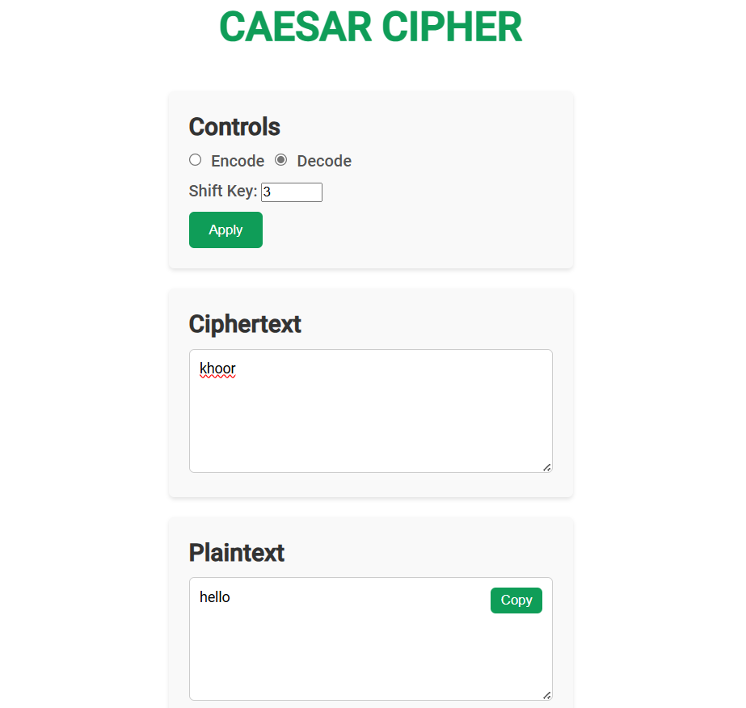
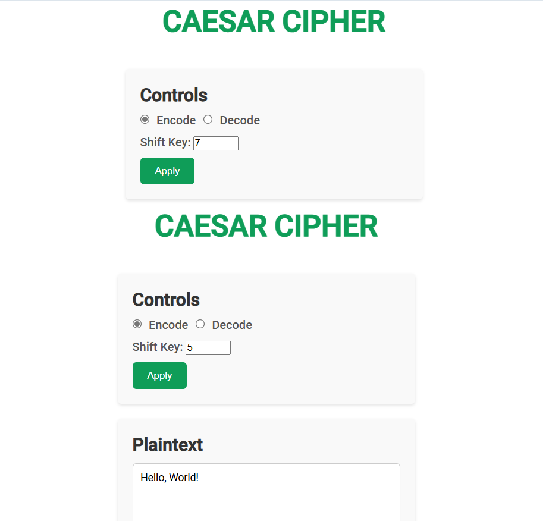

# Caesar Cipher Tool Documentation
## Table of Contents
1. [Project Overview](#project-overview)
2. [Installation](#installation)
3. [Usage](#usage)
4. [Caesar Cipher Algorithm](#caesar-cipher-algorithm)
5. [Examples](#examples)
## Project Overview
The Caesar Cipher Tool is a web-based application that allows users to encrypt and decrypt messages using the Caesar Cipher algorithm. The tool provides an intuitive interface for encoding and decoding text with a customizable shift value.
## Installation
To install and run the Caesar Cipher Tool locally, follow these steps:
1. Clone the project repository: `git clone https://github.com/RobCyberLab/Caesar-Cipher-Tool.git`
2. Navigate to the project directory: `cd src`
3. Open the `index.html` file in your preferred web browser.
## Usage
1. Open the Caesar Cipher Tool in your web browser.
2. Select the desired operation mode: Encode or Decode.
3. Enter the text you want to encrypt or decrypt in the input text area.
4. Set the desired shift value using the number input field.
5. Click the "Apply" button to perform the encryption or decryption.
6. The result will be displayed in the output text area.
7. To copy the output text, click the "Copy" button.
## Caesar Cipher Algorithm
The Caesar Cipher is a substitution cipher that shifts each character in the plaintext by a fixed number of positions. The encryption and decryption process is performed differently for letters and numbers.

For letters, the encryption and decryption process can be represented by the following logic:
```javascript
let code = char.charCodeAt(0);
let baseCode = char === char.toUpperCase() ? 65 : 97;
code = (code - baseCode + shift) % 26 + baseCode;
char = String.fromCharCode(code);
```

In this logic, the character's ASCII code is obtained using `charCodeAt(0)`. The `baseCode` is determined based on whether the character is uppercase (65 for 'A') or lowercase (97 for 'a'). The character's code is then shifted by the specified `shift` value, modulo 26 (the number of letters in the English alphabet), and converted back to the corresponding shifted character using `String.fromCharCode(code)`.

For numbers, the encryption and decryption process is performed using the following logic:
```javascript
char = String.fromCharCode((char.charCodeAt(0) - 48 + shift) % 10 + 48);
```

In this case, the number's ASCII code is obtained using `charCodeAt(0)`, and 48 is subtracted to get the actual numeric value (0-9). The numeric value is then shifted by the specified `shift` value, modulo 10 (the number of digits), and converted back to the corresponding shifted number by adding 48 and using `String.fromCharCode()`.

## Examples
1. Encoding "hello" with a shift of 3 should result in "khoor".

![Example 1: Encoding "hello" with a shift of 3]

2. Decoding "khoor" with a shift of 3 should result in "hello".



3. Encoding "Hello, World!" with a shift of 5 should result in "Mjqqt, Btwqi!".



4. Encoding "Cipher123" with a shift of 7 should result in "Jpwoly890".


In the last example, the letters are shifted by 7 positions, while the numbers are shifted by 7 positions modulo 10. Therefore, "1" becomes "8", "2" becomes "9", and "3" becomes "0".
